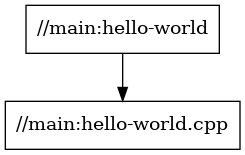

# Stage1

単一ターゲット、単一パッケージのビルド

```
cpp
└─stage1
    ├─ main
    |   ├─ BUILD
    |   └─ hello-world.cpp
    └─ WORKSPACE
```

ひとつのコマンドライン引数を文字列として取得し、

- 文字列 `"Hello （引数）"` （デフォルト引数は`"world"`）
- 実行時のローカル時間文字列

を出力するプログラムを作成する。

## パッケージ

### main

- hello-world.cpp

  エントリポイント `main` のほか2つの関数からなる。

  - `get_greet()`: 文字列引数（参照）を取得し、文字列 `"Hello （引数）"` を返す。
  - `print_localtime()`: 実行時のローカル時間文字列を標準出力に出力する。

  ```cpp
  #include <ctime>
  #include <string>
  #include <iostream>

  std::string get_greet(const std::string& who) {
      return "Hello " + who;
  }

  void print_localtime() {
      std::time_t result = std::time(nullptr);

      std::cout << std::asctime(std::localtime(&result));
  }

  int main(int argc, char** argv) {
      std::string who = "world";
      if (argc > 1) {
          who = argv[1];
      }

      std::cout << get_greet(who) << std::endl;

      print_localtime();

      return 0;
  }
  ```

- BUILD

  実行バイナリ `hello-world` の生成ルールを記述する。

  - ビルドルールは [Starlark](https://github.com/bazelbuild/starlark) というDSLで記述される。
  - `load` で定義済みのC/C++ルールを読み込む。
    - [C/C++ Rules](https://bazel.build/reference/be/c-cpp?hl=en)
  - `cc_binary` は実行バイナリを生成するためのルール。ここではターゲット名とソースファイルを記述している。

  ```bazel
  # Load a build rule of C++
  load("@rules_cc//cc:defs.bzl", "cc_binary")

  # Binary rule
  cc_binary(
      # Target name, "hello-world"
      name = "hello-world",
      # Source list, relative path to a package directory
      srcs = ["hello-world.cpp"],
  )
  ```

## ビルド

`bazel build <label>` でビルドを実行する。

パッケージ `main` のターゲット `hello-world` をビルドするため、指定するラベルは `//main:hello-world` となる。

```sh
$ cd cpp/stage1

$ bazel build //main:hello-world
INFO: Analyzed target //main:hello-world (36 packages loaded, 155 targets configured).
INFO: Found 1 target...
Target //main:hello-world up-to-date:
  bazel-bin/main/hello-world
INFO: Elapsed time: 0.614s, Critical Path: 0.26s
INFO: 6 processes: 4 internal, 2 linux-sandbox.
INFO: Build completed successfully, 6 total actions
```

ビルド成果物が `bazel-***` ディレクトリに生成される。

実際はシンボリックリンクで、ホームディレクトリ以下にキャッシュが保持されている。

```sh
$ ls
WORKSPACE  bazel-bin  bazel-out  bazel-stage1  bazel-testlogs  main

$ ls -al
*** Feb 22 02:40 .
*** Feb 22 02:52 ..
*** Feb 23 23:55 README.md
*** Feb 22 02:40 WORKSPACE
*** Feb 22 02:40 bazel-bin -> $HOME/.cache/bazel/_bazel_ubuntu/5c84d9dc717f789b9d29b05a5d83e10b/execroot/__main__/bazel-out/k8-fastbuild/bin
*** Feb 22 02:40 bazel-out -> $HOME/.cache/bazel/_bazel_ubuntu/5c84d9dc717f789b9d29b05a5d83e10b/execroot/__main__/bazel-out
*** Feb 22 02:40 bazel-stage1 -> $HOME/.cache/bazel/_bazel_ubuntu/5c84d9dc717f789b9d29b05a5d83e10b/execroot/__main__
*** Feb 22 02:40 bazel-testlogs -> $HOME/.cache/bazel/_bazel_ubuntu/5c84d9dc717f789b9d29b05a5d83e10b/execroot/__main__/bazel-out/k8-fastbuild/testlogs
*** Feb 22 02:40 main
```

## 実行

`bazel-bin` 以下に実行バイナリが生成される。

```sh
$ ./bazel-bin/main/hello-world
Hello world
Wed Feb 22 02:32:21 2023

# 引数指定
$ ./bazel-bin/main/hello-world Goodbye
Hello Goodbye
Wed Feb 22 02:33:07 2023
```

また、`bazel run <label>` でビルド・実行を一括で実施する。

```sh
$ bazel run //main:hello-world
INFO: Analyzed target //main:hello-world (0 packages loaded, 0 targets configured).
INFO: Found 1 target...
Target //main:hello-world up-to-date:
  bazel-bin/main/hello-world
INFO: Elapsed time: 0.126s, Critical Path: 0.00s
INFO: 1 process: 1 internal.
INFO: Build completed successfully, 1 total action
INFO: Running command line: bazel-bin/main/hello-world
Hello world
Wed Feb 22 02:31:49 2023

# 引数指定
$ bazel run //main:hello-world Goodbye
INFO: Analyzed target //main:hello-world (0 packages loaded, 0 targets configured).
INFO: Found 1 target...
Target //main:hello-world up-to-date:
  bazel-bin/main/hello-world
INFO: Elapsed time: 0.179s, Critical Path: 0.00s
INFO: 1 process: 1 internal.
INFO: Build completed successfully, 1 total action
INFO: Running command line: bazel-bin/main/hello-world Goodbye
Hello Goodbye
Wed Feb 22 02:31:58 2023
```

## Dependency graph

ターゲットの依存関係グラフをDOT言語で出力し、可視化が可能。

```sh
$ sudo apt update && sudo apt install graphviz

$ bazel query --notool_deps --noimplicit_deps "deps(//main:hello-world)" --output graph > hello-world.dot

$ cat hello-world.dot
digraph mygraph {
  node [shape=box];
  "//main:hello-world"
  "//main:hello-world" -> "//main:hello-world.cpp"
  "//main:hello-world.cpp"
}

$ dot -Kdot -Tpng hello-world.dot -ohello-world.png
```


