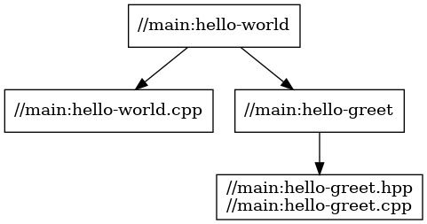

# Stage2

複数ターゲット

```
cpp
└─stage2
    ├─ main
    |   ├─ BUILD
    |   ├─ hello-world.cpp
    |   ├─ hello-greet.cpp
    |   └─ hello-greet.hpp
    └─ WORKSPACE
```



## パッケージ

### main

プログラムはstage1と同一。

- hello-world.cpp

  ```cpp
  #include <ctime>
  #include <string>
  #include <iostream>

  #include "hello-greet.hpp"

  void print_localtime() {
      std::time_t result = std::time(nullptr);

      std::cout << std::asctime(std::localtime(&result));
  }

  int main(int argc, char** argv) {
      std::string who = "world";
      if (argc > 1) {
          who = argv[1];
      }

      std::cout << get_greet(who) << std::endl;

      print_localtime();

      return 0;
  }
  ```

- hello-greet.hpp

  ```cpp
  #ifndef MAIN_HELLO_GREET_H
  #define MAIN_HELLO_GREET_H

  #include <string>

  std::string get_greet(const std::string &who);

  #endif // MAIN_HELLO_GREET_H
  ```

- hello-greet.cpp

  ```cpp
  #include "hello-greet.hpp"

  #include <string>

  std::string get_greet(const std::string &who) {
      return "Hello " + who;
  }
  ```

- BUILD

  - `cc_library` はライブラリ生成のためのルール。
    - `hdrs` には、ライブラリがインタフェースとして外部に公開するヘッダファイルを記述する。非公開のものは`src` 側に記述する。
  - 上記ライブラリをリンクする`cc_binary`ルールの依存関係として、 `deps` に対象のターゲットを記述する。
    - 同一のパッケージ内であれば、パッケージ名は省略できる。
    - 直接依存関係のみを指定する。

  ```bazel
  load("@rules_cc//cc:defs.bzl", "cc_binary", "cc_library")

  # Library rule
  cc_library(
      # Target name, "hello-greet"
      name = "hello-greet",
      # Source list
      srcs = ["hello-greet.cpp"],
      # Header list
      hdrs = ["hello-greet.hpp"],
  )

  cc_binary(
      name = "hello-world",
      srcs = ["hello-world.cpp"],
      # Dependency list
      deps = [
          # Dependent target (library)
          "//main:hello-greet",
          # Can be specified with relative path:
          # ":hello-greet"
      ],
  )
  ```

## ビルド

```sh
$ cd cpp/stage2

$ bazel build //main:hello-world
Starting local Bazel server and connecting to it...
INFO: Analyzed target //main:hello-world (36 packages loaded, 158 targets configured).
INFO: Found 1 target...
Target //main:hello-world up-to-date:
  bazel-bin/main/hello-world
INFO: Elapsed time: 4.047s, Critical Path: 0.29s
INFO: 7 processes: 4 internal, 3 linux-sandbox.
INFO: Build completed successfully, 7 total actions
```

ターゲットを指定して、ライブラリ単体でのビルドが可能。
ビルド成果物は`bazel-bin` 以下に生成される。
- デフォルトでは静的ライブラリ、共有ライブラリの両者がビルドされる。

```
$ bazel build //main:hello-greet
INFO: Analyzed target //main:hello-greet (0 packages loaded, 0 targets configured).
INFO: Found 1 target...
Target //main:hello-greet up-to-date:
  bazel-bin/main/libhello-greet.a
  bazel-bin/main/libhello-greet.so
INFO: Elapsed time: 0.243s, Critical Path: 0.08s
INFO: 5 processes: 3 internal, 2 linux-sandbox.
INFO: Build completed successfully, 5 total actions

$ file ./bazel-bin/main/libhello-greet.a
./bazel-bin/main/libhello-greet.a: current ar archive

$ file ./bazel-bin/main/libhello-greet.so
./bazel-bin/main/libhello-greet.so: ELF 64-bit LSB shared object, x86-64, version 1 (SYSV), dynamically linked, BuildID[sha1]=69d6141a062428c11432051fecc71663c8d0aa51, not stripped
```

## 実行

```sh
$ ./bazel-bin/main/hello-world
Hello world
Thu Feb 23 02:47:19 2023
```
