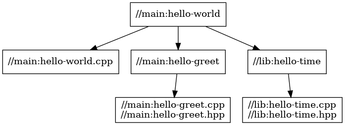

# Stage3

複数ターゲット、複数パッケージ

```
cpp
└─stage3
    ├─ lib
    |   ├─ BUILD
    |   ├─ hello-time.cpp
    |   └─ hello-time.hpp
    ├─ main
    |   ├─ BUILD
    |   ├─ hello-world.cpp
    |   ├─ hello-greet.cpp
    |   └─ hello-greet.hpp
    └─ WORKSPACE
```



## パッケージ

### main

プログラムはstage1と同一。

- hello-world.cpp

  関数 `get_greet()`、`print_localtime()` を別モジュールから呼び出す。

  ```cpp
  #include <string>
  #include <iostream>

  #include "lib/hello-time.hpp"
  #include "hello-greet.hpp"

  int main(int argc, char** argv) {
      std::string who = "world";
      if (argc > 1) {
          who = argv[1];
      }

      std::cout << get_greet(who) << std::endl;

      print_localtime();

      return 0;
  }
  ```

- hello-greet.hpp
- hello-greet.cpp

  stage2 と同一。

- BUILD

  パッケージ `lib` 内のライブラリへの依存関係を `dep` に追加する。

  ```bazel
  load("@rules_cc//cc:defs.bzl", "cc_binary", "cc_library")

  cc_library(
      name = "hello-greet",
      srcs = ["hello-greet.cpp"],
      hdrs = ["hello-greet.hpp"],
  )

  cc_binary(
      name = "hello-world",
      srcs = ["hello-world.cpp"],
      deps = [
          "//main:hello-greet",
          # Dependent package
          "//lib:hello-time",
      ],
  )
  ```

### lib

関数 `print_localtime()` を含むモジュールをパッケージ`lib` としてまとめる。

- hello-time.hpp

  ```cpp
  #ifndef LIB_HELLO_TIME_HPP
  #define LIB_HELLO_TIME_HPP

  void print_localtime();

  #endif // LIB_HELLO_TIME_HPP
  ```

- hello-time.cpp

  ```cpp
  #include "lib/hello-time.hpp"
  #include <ctime>
  #include <iostream>

  void print_localtime() {
      std::time_t result = std::time(nullptr);
      std::cout << std::asctime(std::localtime(&result));
  }
  ```

- BUILD

  ターゲット `hello-time` を他のパッケージから参照できるように、可視化属性 `visibility` を設定する。

  - `"//visibility:public"`: すべてのパッケージへのアクセスを許可する。
  - `"//visibility:private"`: 追加のアクセス権を付与しない。パッケージ内部のみから参照できる。
    - `visibility` および `default_visibility` の設定がない場合、デフォルトの設定値として適用される。
  - `"//foo/bar:__pkg__"`: `//foo/bar` へのアクセス権を付与する。
  - `"//foo/bar:__subpackages__"`: `//foo/bar` およびそのサブパッケージへのアクセス権を付与する。

  ```bazel
  # Package "lib"
  load("@rules_cc//cc:defs.bzl", "cc_library")

  cc_library(
      name = "hello-time",
      srcs = ["hello-time.cpp"],
      hdrs = ["hello-time.hpp"],
      # Grants access to "//main" package (w/o subpackages)
      visibility = ["//main:__pkg__"],
  )
  ```

## ビルド

```sh
$ cd cpp/stage3

$ bazel build //main:hello-world
Starting local Bazel server and connecting to it...
INFO: Analyzed target //main:hello-world (37 packages loaded, 161 targets configured).
INFO: Found 1 target...
Target //main:hello-world up-to-date:
  bazel-bin/main/hello-world
INFO: Elapsed time: 3.813s, Critical Path: 0.32s
INFO: 8 processes: 4 internal, 4 linux-sandbox.
INFO: Build completed successfully, 8 total actions
```

stage2と同様に、ラベルを指定してライブラリをビルド可能。

```
$ bazel build //lib:hello-time 
INFO: Analyzed target //lib:hello-time (36 packages loaded, 155 targets configured).
INFO: Found 1 target...
Target //lib:hello-time up-to-date:
  bazel-bin/lib/libhello-time.a
  bazel-bin/lib/libhello-time.so
INFO: Elapsed time: 0.747s, Critical Path: 0.27s
INFO: 6 processes: 3 internal, 3 linux-sandbox.
INFO: Build completed successfully, 6 total actions
```

## 実行

```sh
$ ./bazel-bin/main/hello-world
Hello world
Thu Feb 23 11:26:13 2023
```
